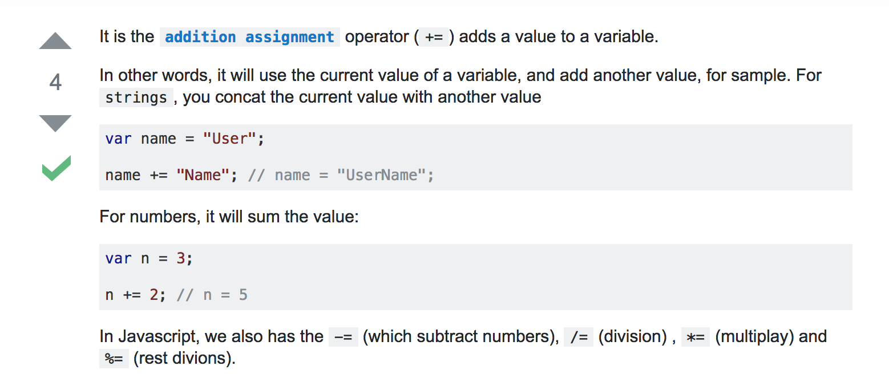

# Loops

### Names, Names, Names 
1. Make an array with everyone in the class' name
1. Loop through the array and console.log each name
1. Loop through the array and console.log each name in all caps
1. Loop through the array and console.log "{each name here} is so smart!"

### Best Num, Num, Nums
1. Make an array of 6 of your favorite numbers
1. Loop through the array and print out each number
1. Loop through the array and print out each number plus 2
1. Loop through the array and if the number is greater than 10 print, "The number is greater than 10." If the number is less than 10, print out, "The number is less than 10."
1. Loop through the array and print out the square root of each number

### Worst Num, Num, Nums
1. Make another array of 10 of your least favorite numbers
1. Loop through the array and print out the square of each number
1. Loop through the array and print out true or false depending on if the number is divisible by 2

### Challenge, Challenge, Challenge
1. Make an array of 10 numbers. Write a **FUNCTION** called `sum` that takes in an array of numbers (in this case the array you just made), and returns the sum of all the numbers. Please use the `+=` operator, and no built-in JavaScript functions.
  
2. Blast Off!!! Write a **FUNCTION** called `blastOff` that takes in a number and counts down to zero from that number — printing each number as it goes. When the countdown gets to zero print out, "BLAST OFF!!!"  

  Results should look like this:  

    

3. Write a **FUNCTION** called `ninetyNineBottles` that console.logs the lyrics to [99 Bottles of Beer on the Wall](http://www.99-bottles-of-beer.net/lyrics.html). Hint: You should loop, but don't use an array. 